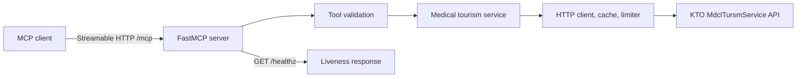

# VisitKorea Medical Tourism MCP Server


[](LICENSE)

## Overview

VisitKorea Medical Tourism MCP Server exposes the Korea Tourism Organization Medical Tourism Open API as eight Model Context Protocol tools. MCP clients can search facilities by area, location, or keyword, retrieve facility details, and synchronize upstream records through Streamable HTTP.

The primary service is a Python package. The repository also contains a pnpm workspace with a React landing page, an Express health API, and shared TypeScript packages used by those applications.

The tourism data comes from the [Korea Public Data Portal](https://www.data.go.kr/data/15143913/openapi.do), service ID `15143913`.

## Key Features

- Eight MCP tools mapped to the `MdclTursmService` API
- Area, coordinate, keyword, and synchronization queries
- Common, introductory, and medical facility details
- English, Japanese, Simplified Chinese, Korean, and Russian responses
- Parameter validation before upstream requests
- Bounded retries, connection pooling, and a process local response cache
- Process local rate limiting for upstream requests
- Streamable HTTP transport with liveness checks

## Tech Stack

| Layer | Technology |
| --- | --- |
| MCP service | Python 3.11+, FastMCP from `mcp[cli]` |
| Upstream client | HTTPX |
| Python packaging | Hatchling, uv |
| Landing page | React, Vite, Tailwind CSS |
| Health API | Express 5, Pino |
| TypeScript workspace | pnpm, TypeScript 5.9 |
| Testing | Python `unittest` |

## Architecture



The Python server creates one HTTP client for its application lifespan. Successful tool calls return a list of dictionaries. Application and upstream failures are converted to typed, client safe errors.

The cache stores up to 256 responses in memory. District code responses use a 24 hour time to live. Other responses use a 5 minute time to live. Cache and rate limit state are not shared between processes.

## Repository Structure

```text
.
├── src/mcp_server/          # Python MCP package
│   ├── clients/             # KTO client, cache, and rate limiter
│   ├── config/              # Runtime settings
│   ├── errors/              # Application error types
│   ├── observability/       # Logging configuration
│   ├── services/            # Medical tourism operations
│   ├── tools/               # MCP tool adapters and registry
│   └── transports/          # Streamable HTTP entry point
├── tests/                   # Unit, contract, integration, and security tests
├── docs/                    # Architecture, capability, deployment, and security notes
├── artifacts/
│   ├── api-server/          # Express health API
│   └── landing/             # React landing page
├── lib/                     # Shared TypeScript packages
├── mcp-server/main.py       # Compatibility entry point
├── pyproject.toml           # Python package and console script
└── pnpm-workspace.yaml      # TypeScript workspace boundaries
```

## Requirements

### MCP service

- Python 3.11 or later
- [uv](https://docs.astral.sh/uv/)
- An approved API key for the KTO `MdclTursmService`

### Full workspace

- Node.js
- pnpm
- The MCP service requirements above

The repository does not pin minimum Node.js or pnpm versions. Use a current supported release that can install `pnpm-lock.yaml`.

## Environment Variables

### MCP service

| Variable | Required | Default | Purpose |
| --- | --- | --- | --- |
| `VISITKOREA_API_KEY` | Yes | None | Encoded or decoded data.go.kr service key |
| `PORT` | No | `8000` | HTTP listener port |
| `MCP_ALLOWED_HOSTS` | No | Localhost entries | Comma separated hosts accepted by transport validation |
| `MCP_ALLOWED_ORIGINS` | No | Localhost entries | Comma separated browser origins accepted by transport validation |
| `REPLIT_DOMAINS` | No | None | Deployment host fallback when `MCP_ALLOWED_HOSTS` is unset |

### TypeScript workspace

| Variable | Component | Required | Purpose |
| --- | --- | --- | --- |
| `PORT` | API server | Yes | Listener port |
| `PORT` | Landing page | Yes | Vite development and build configuration |
| `NODE_ENV` | API server, landing page | No | Development or production behavior |
| `LOG_LEVEL` | API server | No | Pino log level, default `info` |
| `BASE_PATH` | Landing page | Yes | Vite base path, such as `/` |
| `DATABASE_URL` | Shared database package | When used | PostgreSQL connection string |
| `REPLIT_DOMAINS` | Landing page | No | Deployment domain metadata |
| `REPL_ID` | Landing page | No | Enables development platform plugins when present |

The MCP service does not use a database. `DATABASE_URL` applies only when the shared database package is imported by a TypeScript application.

## Installation

Clone the repository:

```bash
git clone https://github.com/leejaew/visitkorea-medicaltourism-mcp.git
cd visitkorea-medicaltourism-mcp
```

Install the Python project:

```bash
uv sync --frozen
```

Install the TypeScript workspace only if you need the landing page, API server, or shared packages:

```bash
pnpm install --frozen-lockfile
```

## Configuration

1. Request access to service `15143913` on the [Korea Public Data Portal](https://www.data.go.kr/data/15143913/openapi.do).
2. Copy the environment template.
3. Replace the placeholder with the issued service key.

```bash
cp .env.example .env
```

Both the encoded and decoded key variants issued by data.go.kr are accepted. The server normalizes the value at startup.

Never commit `.env` or a real service key.

## Local Development

Start the MCP service:

```bash
uv run visitkorea-mcp
```

Equivalent package entry points:

```bash
uv run python -m mcp_server
python mcp-server/main.py
```

The compatibility script requires the Python dependencies to be installed in the active environment.

### MCP endpoints

| Method and path | Purpose |
| --- | --- |
| `POST /mcp` | Streamable HTTP MCP traffic |
| `GET /healthz` | Liveness response |

The default local base URL is `http://localhost:8000`.

### MCP client configuration

Use the deployed HTTPS endpoint in any client that supports Streamable HTTP:

```json
{
  "mcpServers": {
    "visitkorea-medicaltourism": {
      "type": "streamableHttp",
      "url": "https://your-domain.example/mcp"
    }
  }
}
```

This configuration does not add client authentication. Apply access controls at the deployment boundary if the service must not be public.

### Supporting applications

Start the Express API:

```bash
PORT=8080 pnpm --filter @workspace/api-server run dev
```

Start the landing page:

```bash
PORT=5173 BASE_PATH=/ pnpm --filter @workspace/landing run dev
```

The Express artifact exposes `GET /api/healthz`.

## MCP Tool Reference

All tools require `lang_div_cd`. List and search tools default to page 1 with 10 results. Detail tools require a `content_id` returned by a list or search operation.

| Tool | Upstream operation | Purpose | Cache |
| --- | --- | --- | --- |
| `get_ldong_code` | `ldongCode` | List province and district codes | 24 hours |
| `get_area_based_list` | `areaBasedList` | Search by administrative area | 5 minutes |
| `get_location_based_list` | `locationBasedList` | Search within 1 to 20,000 metres of WGS84 coordinates | 5 minutes |
| `search_medical_by_keyword` | `searchKeyword` | Search upstream facility records by keyword | 5 minutes |
| `get_medical_sync_list` | `mdclTursmSyncList` | Page through synchronization records | 5 minutes |
| `get_detail_common` | `detailCommon` | Retrieve address, contact, location, and overview fields | 5 minutes |
| `get_detail_intro` | `detailIntro` | Retrieve hours, parking, capacity, and related fields | 5 minutes |
| `get_detail_medical` | `detailMdclTursm` | Retrieve specialties, service languages, and reservation fields | 5 minutes |

### Language codes

| Code | Language |
| --- | --- |
| `ENG` | English |
| `JPN` | Japanese |
| `CHS` | Simplified Chinese |
| `KOR` | Korean |
| `RUS` | Russian |

Tool docstrings provide the complete parameter schemas to connected MCP clients.

## Build and Packaging

Build Python wheel and source distributions:

```bash
uv build
```

Python packages are written to `dist/`.

Typecheck and build every TypeScript workspace package that defines a build script:

```bash
PORT=5173 BASE_PATH=/ pnpm run build
```

Relevant output directories:

| Component | Output |
| --- | --- |
| Python package | `dist/` |
| Express API | `artifacts/api-server/dist/` |
| Landing page | `artifacts/landing/dist/` |

## Testing

Run the Python test suite:

```bash
uv run --frozen python -m unittest discover -s tests -p 'test_*.py'
```

The suite covers unit behavior, endpoint contracts, ASGI integration, registration, and security boundaries. Tests use mocked upstream responses and do not require a live service key unless a test explicitly performs a live API check.

## Code Quality

Typecheck the TypeScript workspace:

```bash
pnpm run typecheck
```

The repository does not currently declare a Python formatter, linter, static type checker, JavaScript test runner, or continuous integration workflow.

## External Service

The MCP service calls:

```text
https://apis.data.go.kr/B551011/MdclTursmService
```

Requests include the server side `VISITKOREA_API_KEY`, fixed mobile application metadata, pagination, and tool specific parameters. Upstream quotas, approval status, availability, content freshness, and response semantics remain controlled by data.go.kr and the Korea Tourism Organization.

## Security Notes

- Store `VISITKOREA_API_KEY` in environment secrets. Do not place it in source, examples, logs, or client configuration.
- The key is excluded from cache keys and application errors.
- HTTP client logging is restricted to reduce the risk of query credentials reaching logs.
- TLS certificate verification remains enabled.
- Host and Origin allowlists protect transport validation. They do not authenticate users.
- The MCP endpoint has no application level user authentication or authorization.
- Review [`docs/security.md`](docs/security.md) before exposing the service publicly.

## Deployment

The repository includes Replit artifact configuration for two services:

| Service | Build | Start | Port | Health |
| --- | --- | --- | --- | --- |
| MCP server | Managed dependency restore | `python mcp-server/main.py` | `8000` | `/healthz` |
| Express API | `pnpm --filter @workspace/api-server run build` | `node --enable-source-maps artifacts/api-server/dist/index.mjs` | `8080` | `/api/healthz` |

Set `VISITKOREA_API_KEY` as a deployment secret. Expose `/mcp` through HTTPS and configure `MCP_ALLOWED_HOSTS` and `MCP_ALLOWED_ORIGINS` for the public domain.

For a portable Python deployment, install and start the locked package directly:

```bash
uv sync --frozen
uv run --frozen visitkorea-mcp
```

The landing page builds as static Vite output. The repository does not include deployment configuration for other hosting providers or container platforms.

See [`docs/deployment.md`](docs/deployment.md) for the service level deployment contract.

## Troubleshooting

### `VISITKOREA_API_KEY is not set`

Create `.env` from `.env.example` for local development, or configure the variable through the deployment secret manager.

### Host or Origin validation rejects a public request

Add the deployment hostname to `MCP_ALLOWED_HOSTS` and browser origins to `MCP_ALLOWED_ORIGINS`. Use comma separated values without credentials or paths.

### Upstream authentication or quota errors

Confirm that the data.go.kr key is approved for service `15143913`, has not expired, and has remaining quota.

### Local rate limit errors

Retry after the interval reported by the tool. The limiter permits 10 upstream calls per minute with a burst capacity of 5. Cache hits do not consume limiter capacity.

## Known Limitations

- Cache and rate limit state are in memory and scoped to one process.
- The service depends on upstream availability, quota, approval, and data quality.
- The MCP endpoint does not provide application level authentication.
- Only Streamable HTTP transport is configured.
- Medical tourism records are informational directory data. They are not medical advice or a guarantee of provider quality, availability, or suitability.
- No Docker, Kubernetes, or provider neutral deployment configuration is included.

## Contributing

Before submitting a change:

1. Run the Python test suite.
2. Run `pnpm run typecheck` for TypeScript changes.
3. Build the affected package or application.
4. Keep service keys and local environment files out of Git.

Use live API checks only when you have an approved key and the change requires upstream verification.

## License

The source code is available under the [MIT License](LICENSE).

Tourism data is provided by the Korea Tourism Organization through the Korea Public Data Portal. Data use remains subject to the source terms. KTO `Type1` content requires attribution. `Type3` content also prohibits modification.